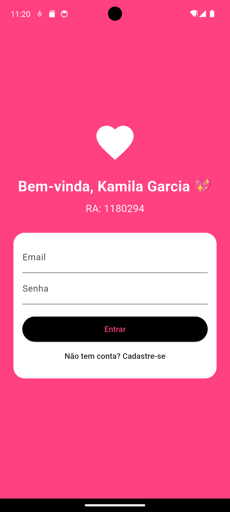
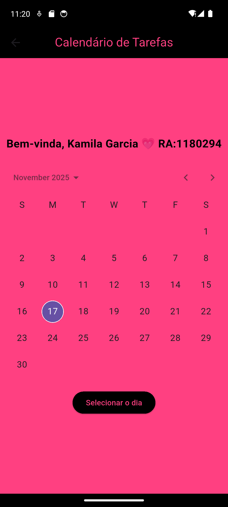
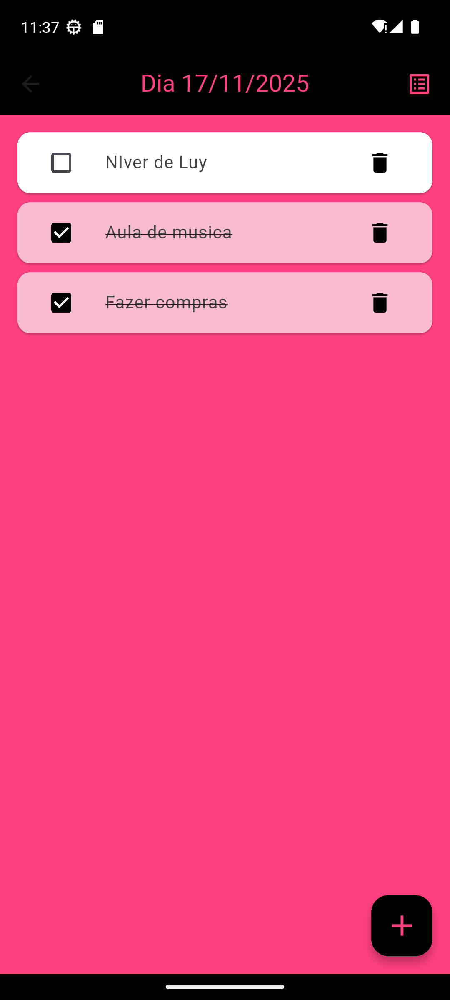

# 📱 Agenda Kamila Garcia Fraga

Aplicativo desenvolvido em **Flutter** para gerenciar tarefas e compromissos diários de forma prática e organizada.  
Este projeto faz parte da avaliação da disciplina de **DESENVOLVIMENTO PARA DISPOSITIVOS MÓVEIS** do curso de **Análise e Desenvolvimento de Sistemas**.

---

## 🌈 Funcionalidades
- 📅 Cadastro e exibição de tarefas no calendário  
- 📝 Adição, edição e exclusão de compromissos  
- 🔐 Tela de login e cadastro de usuários  
- ☁️ Armazenamento local das tarefas  
- ✅ Marcação de tarefas como concluídas, com organização por status e ordem alfabética  

---

## 🧩 Tecnologias utilizadas
- **Flutter** (Dart)  
- **Material Design**  
- **Local Storage**  

---

## 🖼 Prints do App

**Tela Login/Cadastro:**  
  

**Tela Calendário:**  
  

**Tela Lista de Tarefas:**  
  

---

## 🚀 Como executar o projeto

1. Clone o repositório:  
```bash
git clone https://github.com/kamigarcia/agenda_kamilagarciafraga.git
